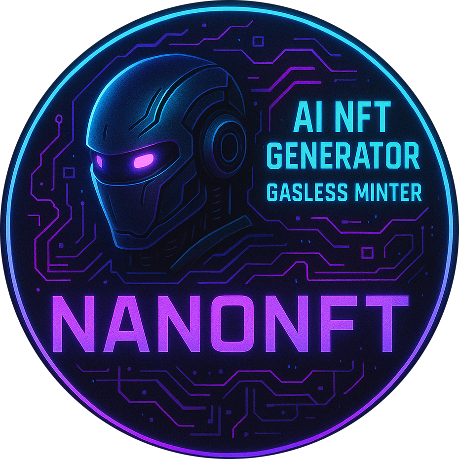

# 🚀 NanoNFT - AI-Powered NFT Generator

<div align="center">
  
  <h2>🤖 Create Unique NFTs with AI • Gasless Minting • Sepolia Testnet</h2>
  <p><em>Generate, mint, and collect AI-powered NFTs with zero gas fees</em></p>
  <br>
  <a href="https://nano-nft.vercel.app"><strong>🌐 Live Demo</strong></a> •
  <a href="#quick-start">📦 Quick Start</a> •
  <a href="#features">✨ Features</a>
</div>

---

## 🎯 What is NanoNFT?

NanoNFT is an innovative AI-powered NFT generator that allows users to create unique digital artwork using Google's Gemini Nano Banana model. Built with gasless minting technology on the Sepolia testnet, it provides a seamless experience for creating and collecting NFTs without worrying about transaction fees.

## ✨ Features

### 🎨 **AI Image Generation**

- **Powered by Google Gemini Nano Banana** - Cutting-edge AI image generation
- **Prompt-based Creation** - Describe your vision in natural language
- **High-Quality Output** - Generate stunning artwork in multiple styles
- **Instant Results** - Get your NFT ready in seconds

### ⛽ **Gasless Minting**

- **Zero Transaction Fees** - Mint NFTs without paying gas
- **Thirdweb Account Abstraction** - Advanced wallet technology
- **Seamless Experience** - No crypto knowledge required
- **Instant Confirmations** - Fast blockchain transactions

### 🎪 **User Experience**

- **Quantum Particle Theme** - Stunning 3D animated background
- **Responsive Design** - Works perfectly on all devices
- **Real-time Feedback** - Live progress indicators
- **NFT Gallery** - View your collection instantly

### 🔒 **Smart Contract Features**

- **ERC-721 Standard** - Industry-standard NFT contract
- **User Limits** - 3 free mints per 24-hour period
- **Metadata Storage** - IPFS integration for permanent storage
- **Sepolia Testnet** - Safe testing environment

## 🚀 Quick Start

### Prerequisites

- **Node.js** 18+ and **pnpm**
- **Wallet** (MetaMask, Coinbase Wallet, etc.)
- **Sepolia ETH** for paid minting (optional - gasless for free mints)

### Installation

1. **Clone the repository**

   ```bash
   git clone <repository-url>
   cd nano-nft
   ```

2. **Install dependencies**

   ```bash
   pnpm install
   ```

3. **Environment Setup**

   Create `.env.local` in the root directory:

   ```env
   # Thirdweb Configuration
   NEXT_PUBLIC_THIRDWEB_CLIENT_ID=your_client_id_here
   THIRDWEB_SECRET_KEY=your_secret_key_here

   # Google Gemini API
   NANO_API=your_google_nano_api_key_here
   ```

4. **Start development server**

   ```bash
   pnpm dev
   ```

5. **Open your browser**
   ```
   http://localhost:3000
   ```

## 🛠️ Project Structure

```
nano-nft/
├── app/                          # Next.js App Router
│   ├── api/                      # API routes
│   │   ├── ai-chat/             # AI chat endpoint
│   │   └── generate-nft/        # NFT generation endpoint
│   ├── globals.css              # Global styles
│   ├── layout.tsx               # Root layout
│   └── page.tsx                 # Main page
├── components/                   # React components
│   ├── NFTGenerator.tsx         # Main NFT creation interface
│   ├── NFTGallery.tsx           # User's NFT collection
│   ├── NFTMintForm.tsx          # Minting form component
│   ├── QuantumParticles.tsx     # 3D particle background
│   └── ConnectWallet.tsx        # Wallet connection
├── contracts/                   # Foundry smart contracts
│   ├── src/                     # Solidity source files
│   ├── test/                    # Contract tests
│   └── script/                  # Deployment scripts
├── lib/                         # Utility libraries
│   ├── client.ts                # Thirdweb client config
│   └── contracts.ts             # Contract instances
└── public/                      # Static assets
```

## 🔧 Tech Stack

### Frontend Framework

- **Next.js 15** - React framework with App Router
- **TypeScript** - Type-safe JavaScript
- **Tailwind CSS** - Utility-first CSS framework
- **Motion** - Animation library (Framer Motion v12)

### Web3 & Blockchain

- **Thirdweb v5** - Complete Web3 development platform
- **Sepolia Testnet** - Ethereum test network
- **Foundry** - Smart contract development framework
- **Solidity** - Smart contract programming language

### AI & APIs

- **Google Gemini Nano Banana** - AI image generation
- **IPFS** - Decentralized file storage
- **Thirdweb Storage** - File upload and hosting

## 🎮 How to Use

1. **Connect Wallet** - Click "Connect Wallet" and choose your preferred wallet
2. **Enter Prompt** - Describe the NFT you want to create
3. **Generate** - Click "Generate NFT" to create your AI artwork
4. **Mint** - Click "Mint NFT" to mint it to the blockchain
5. **Collect** - View your NFTs in the gallery below

### User Limits

- **Free Mints**: 3 per 24-hour period
- **Cooldown**: 24 hours between free mint sessions
- **Paid Mints**: Unlimited (requires Sepolia ETH)

## 🌐 Live Demo

Experience NanoNFT live at: **[nano-nft.vercel.app](https://nano-nft.vercel.app)**

Try it out:

- Generate AI-powered NFTs
- Experience gasless minting
- Explore the quantum particle interface

## 🏗️ Smart Contracts

### NanoNFT Contract

- **Location**: `contracts/src/NanoNFT.sol`
- **Standard**: ERC-721
- **Network**: Sepolia Testnet
- **Features**:
  - Gasless minting support
  - User creation limits
  - IPFS metadata storage
  - Owner controls

### Deployment

```bash
cd contracts
forge build
forge test
forge script script/NanoNFT.s.sol --rpc-url $SEPOLIA_RPC_URL --broadcast
```

## 🔐 Environment Variables

### Required Variables

```env
# Thirdweb (get from https://thirdweb.com/dashboard)
NEXT_PUBLIC_THIRDWEB_CLIENT_ID=your_client_id_here
THIRDWEB_SECRET_KEY=your_secret_key_here

# Google Gemini (get from https://aistudio.google.com/)
NANO_API=your_google_nano_api_key_here
```

### Optional Variables

```env
# Custom RPC endpoints
SEPOLIA_RPC_URL=https://sepolia.infura.io/v3/YOUR_PROJECT_ID
```

## 📜 Scripts

- `pnpm dev` - Start development server
- `pnpm build` - Build for production
- `pnpm start` - Start production server
- `pnpm lint` - Run ESLint

## 🤝 Contributing

1. Fork the repository
2. Create a feature branch (`git checkout -b feature/amazing-feature`)
3. Commit your changes (`git commit -m 'Add amazing feature'`)
4. Push to the branch (`git push origin feature/amazing-feature`)
5. Open a Pull Request

## 📄 License

This project is licensed under the MIT License - see the [LICENSE](LICENSE) file for details.

## 🌟 Support

If you find this project helpful, please give it a ⭐ on GitHub!

# 👨‍💻 About the Developer

<p align="center">
  
</p>

Assalamualaikum guys! 🙌 This is Mohammad Ayaan Siddiqui (♦moayaan.eth♦). I’m a **Full Stack Blockchain Developer** and **MBA in Blockchain Management** with over **2 years of experience** rocking the Web3 world! 🚀 I’ve worn many hats:

- Research Intern at a Hong Kong-based firm 🇭🇰
- Technical Co-Founder at a Netherlands-based firm 🇳🇱
- Full Stack Intern at a Singapore-based crypto hardware wallet firm 🇸🇬
- Currently a Blockchain Developer on a US-based Bitcoin DeFi project 🇺🇸
- Completed PG Diploma in Blockchain Management from Cambridge International Qualifications (CIQ) 🇬🇧
- Currently pursuing an online MBA in Blockchain Management from University of Studies Guglielmo Marconi, Italy 🇮🇹

Let’s connect and build something epic! Find me at [moayaan.com](https://moayaan.com) 🌐

If you liked this project, please donate to Gaza 🇵🇸 [UNRWA Donation Link](https://donate.unrwa.org/-landing-page/en_EN)

Happy coding, fam! 😎✨
